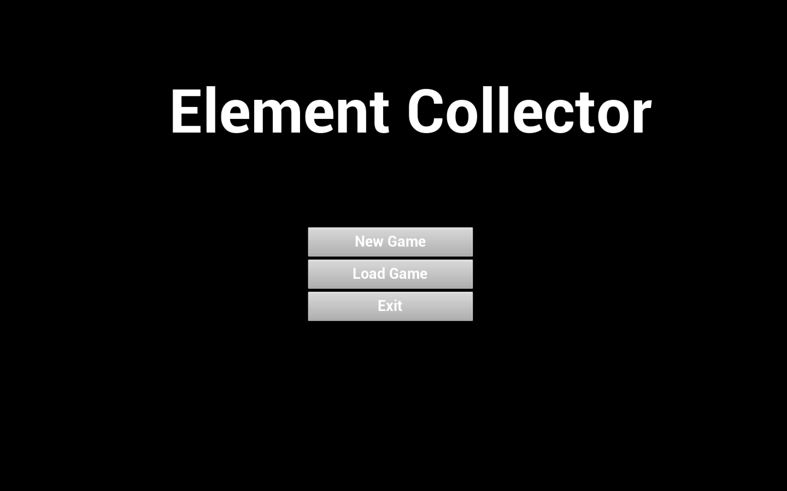

项目传送门：https://github.com/WillKen/ElementCollector

视频演示：[ElementCollector｜游戏Demo演示-哔哩哔哩](https://b23.tv/goP5bSU)
# 开发环境

操作系统：macOS Monterey 12.5 （MacBook pro M1）

游戏引擎：UE4.27.2

# 游戏背景与玩法介绍

本游戏名为Element Collector。在游戏中，玩家需要根据目标完成相应元素的收集来解锁传送门并进入下一关。

玩家使用WASD以及空格控制人物的移动与跳跃。

当满足通关条件时，传送门会有红色变为绿色，当玩家进入传送门时即可进入下一关。

在游戏过程中可按Q键进行存档并返回菜单界面。

# 游戏界面介绍




界面中蓝色元素为风元素(Anemo)，黄色元素为岩元素(Geo)，紫色元素为雷元素(Electro)。橙色门框是传送门。

游戏界面左上角第一行分别是当前关卡等级，当前元素成就，括号内依次为风、岩、雷元素成就。

游戏界面左上角第二行分别是当前关卡中风、岩、雷元素已收集个数/目标数。


当完成目标后，传送门会变为绿色。

# 技术简介

在本项目中除Widget的text绑定以及菜单页面的按钮点击外均采用C++代码完成。

下面将选取一些重要功能进行介绍。

**碰撞功能的实现：**

​	在游戏中ElementActor和PortalActor均实现了碰撞功能。

​	当角色与ElementActor发生碰撞时，会进行角色元素值的增减，并计算是否满足升级条件，最后销毁ElementActor；当角色与PortalActor碰撞时，会根据是否满足升级条件进行level的切换。

​	碰撞功能是通过`Sphere->OnComponentBeginOverlap.AddDynamic(**this**, &AElementActor::OnOverlapBegin);`实现的。

**Material的动态变换：**

​	PortalActor每一帧进行检查，若达到升级条件则进行material的变换。

```C++
void APortalActor::Tick(float DeltaTime)
{
    Super::Tick(DeltaTime);
    if(myGameStateBase->LevelClear==true){
        static UMaterialInterface* EnterMaterial=LoadObject<UMaterialInterface>(nullptr, TEXT("Material'/Game/Materials/PortalEnterMaterial.PortalEnterMaterial'"));
        StaticMesh->SetMaterial(0,EnterMaterial);
    }
}
```

**游戏的保存：**

​	首先，绑定action，使得按下Q调用保存函数。

```C++
void AMyPlayerController::SetupInputComponent()
{
    InputComponent->BindAction("Q", IE_Pressed, this, &AMyPlayerController::save);
}
```

​	接着，在save函数中保存相关游戏参数。

```c++
void AMyPlayerController::save()
{
    UE_LOG(LogTemp, Warning, TEXT("Q_Pressed!"));
    mySaveGame->ElementOverall=myGameInstance->ElementOverall;
    mySaveGame->AnemoValueOverall=myGameInstance->AnemoValueOverall;
    mySaveGame->GeoValueOverall=myGameInstance->GeoValueOverall;
    mySaveGame->ElectroValueOverall=myGameInstance->ElectroValueOverall;
    mySaveGame->AnemoValue=myGameInstance->AnemoValue;
    mySaveGame->GeoValue=myGameInstance->GeoValue;
    mySaveGame->ElectroValue=myGameInstance->ElectroValue;
    mySaveGame->CurrentLevel=myGameInstance->CurrentLevel;
    TArray<AActor*> ElementActors;
    UGameplayStatics::GetAllActorsOfClass(GetWorld(),AElementActor::StaticClass(),ElementActors);
    for(AActor* eleActor:ElementActors){
        AElementActor* eleA=Cast<AElementActor>(eleActor);
        UE_LOG(LogTemp, Warning, TEXT("Survive:%s"),*eleA->GetName());
        mySaveGame->ActorName.Add(eleA->GetName());
    }
    bool flag=UGameplayStatics::SaveGameToSlot(mySaveGame, TEXT("willken"), 0);
    if(flag){
        UE_LOG(LogTemp, Warning, TEXT("Game_Saved!"));
//        ConsoleCommand("quit");
        UGameplayStatics::OpenLevel(UGameplayStatics::GetPlayerController(GWorld, 0)->GetWorld(), FName("Level_Menu"));
    }
}
```

**加载游戏时已收集过元素的销毁：**

​	每个element元素中设置属性Died,初始均为false。

​	存档时，保存当前场上剩余Actor的名称，保存在TArray<FString>中。

​	读档时，现对所有Actor->Died设置为true，再将与TArray中名称一样的Actor->Died置为false。

​	为了保证只在读档时进行Actor存活检查，所以引入变量myGameInstance->loaded，在读档时设为true，Actor存活检查结束后设置为false。

```c++
void AMyPlayerController::BeginPlay(){
    ...
    ...
    if(myGameInstance->loaded==true){
        UE_LOG(LogTemp, Warning, TEXT("GameLoaded"));
        TArray<AActor*> ElementActors;
        UGameplayStatics::GetAllActorsOfClass(GetWorld(),AElementActor::StaticClass(),ElementActors);
        for(AActor* eleActor:ElementActors){
            AElementActor* eleA=Cast<AElementActor>(eleActor);
            eleA->Died=true;
        }
        for(FString name:myGameInstance->ActorName){
            for(AActor* eleActor:ElementActors){
                AElementActor* eleA=Cast<AElementActor>(eleActor);
                if(eleA->GetName()==name){
                    eleA->Died=false;
                }
            }
        }
        myGameInstance->loaded=false;
    }

}
```

# 游戏模式总结

**GameMode：**GameMode与场景的生命周期是相同的。使用OpenLevel切换到另外一个场景，第一个场景的GameMode就会被销毁，然后加载第二个场景的GameMode。只存在与服务器。GameMode里登记了游戏里基本需要的信息，如：

```C++
AElementCollectorGameMode::AElementCollectorGameMode()
{
    UE_LOG(LogTemp, Warning, TEXT("AElementCollectorGameMode()"));
	// set default pawn class to our Blueprinted character
	static ConstructorHelpers::FClassFinder<APawn> PlayerPawnBPClass(TEXT("/Game/ThirdPersonCPP/Blueprints/ThirdPersonCharacter"));
	if (PlayerPawnBPClass.Class != NULL)
	{
		DefaultPawnClass = PlayerPawnBPClass.Class;
	}
    PlayerControllerClass = AMyPlayerController::StaticClass();
    GameStateClass = AMyGameStateBase::StaticClass();
}
```

**GameState：**GameState存在于服务端和所有客户端，可以自由的复制以保证客户端数据都是最新的。GameState可以允许客户端访问一些游戏数据如：得分、匹配时间，而访问不了GameMode里面的敏感数据。在本项目中，主要进行是否满足升级条件的判断。

**GameInstance：**与进程的生命周期相同，同时存在于服务端和所有客户端。只要进入游戏，GameInstance就会被创建，并且保证只创建一个GameInstance，只要不退出游戏，GameInstance就会一直存在，不会被销毁。

**各个类的创建次序：**


